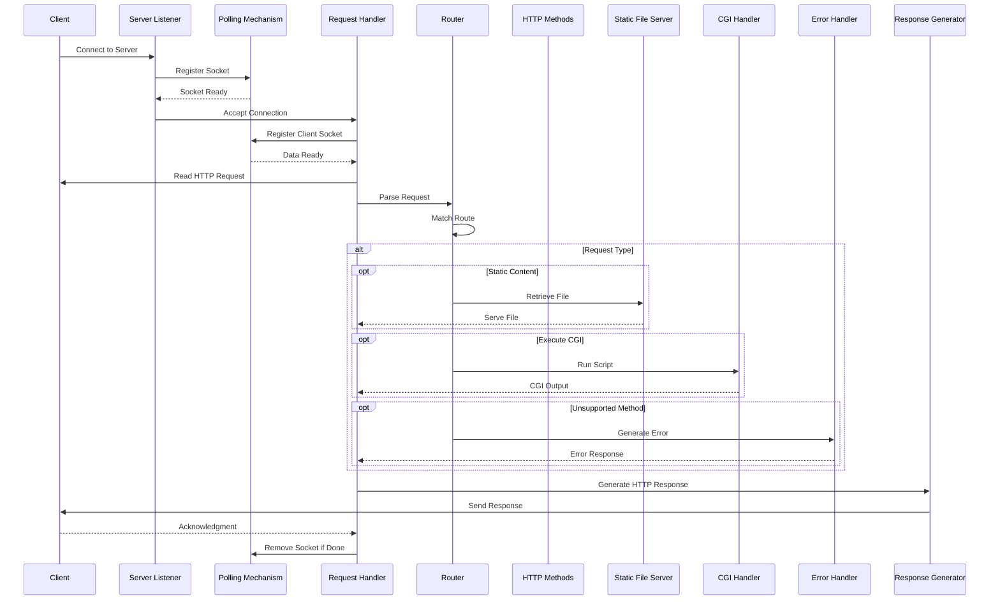

# Brief overview and a high-level guide for the implementation 

1. **Configuration File Parsing:**
    - **Objective:** The server should accept a configuration file or use a default one.
    - **Action:** Implement a parser to read the configuration file. This parser should be able to:
        - Set up multiple servers with different ports and hosts.
        - Define server names.
        - Set default error pages.
        - Limit client body sizes.
        - Configure routes with specific rules (accepted methods, redirections, root directories, directory listing options, default files, CGI execution based on file extension, file upload handling).

2. **Setting Up Server Sockets:**
    - **Objective:** Listen on multiple ports as specified in the configuration.
    - **Action:** For each server configuration:
        - Create a socket using `socket()`.
        - Bind it to the specified host and port using `bind()`.
        - Start listening for connections with `listen()`.
        - Set the socket to non-blocking mode using `fcntl()` with `O_NONBLOCK`.

3. **Event Handling with `poll()`:**
    - **Objective:** Use a single `poll()` (or equivalent) for all I/O operations.
    - **Action:**
        - Initialize a `pollfd` array containing all the listening sockets.
        - In the main loop, call `poll()` to monitor all sockets for readiness to read or write.
        - When `poll()` indicates activity:
            - Accept new connections with `accept()` and add them to the `pollfd` array.
            - Read from client sockets that are ready to read.
            - Write to client sockets that are ready to write.

4. **Handling Client Connections:**
    - **Objective:** Manage multiple client connections without blocking.
    - **Action:**
        - Set all client sockets to non-blocking mode.
        - For each client, read the HTTP request when data is available.
        - Parse the request to determine the method, URI, headers, and body.

5. **Request Processing:**
    - **Objective:** Serve static content, handle CGI, and process file uploads.
    - **Action:**
        - **Routing:**
            - Match the request URI against the configured routes.
            - Apply the rules specified for the route (e.g., methods allowed, redirections, root directory).
        - **Method Handling:**
            - Implement GET, POST, and DELETE methods.
            - For GET, serve files or generate directory listings if enabled.
            - For POST, handle form submissions and file uploads, saving files as configured.
            - For DELETE, remove the specified resource if allowed.
        - **CGI Execution:**
            - If a request matches a route that requires CGI execution:
                - Use `fork()` and `execve()` to run the CGI script.
                - Set up environment variables as needed (e.g., `REQUEST_METHOD`, `PATH_INFO`).
                - Communicate with the CGI process using pipes (`pipe()`, `dup2()`).
                - Ensure the server un-chunks chunked requests before passing them to the CGI.
        - **Error Handling:**
            - Send appropriate HTTP status codes.
            - Use default error pages if none are specified.

6. **Response Handling:**
    - **Objective:** Send accurate and complete HTTP responses.
    - **Action:**
        - Construct response headers, including `Content-Length`, `Content-Type`, and any others required.
        - For persistent connections, handle the `Connection` header appropriately.
        - Send the response back to the client through the non-blocking socket.

7. **Resource Management:**
    - **Objective:** Ensure the server is resilient and does not leak resources.
    - **Action:**
        - Properly close sockets when done.
        - Clean up any dynamic memory allocations.
        - Handle signals to prevent zombie processes from `fork()`.

8. **Testing and Validation:**
    - **Objective:** Verify that the server meets all requirements and handles edge cases.
    - **Action:**
        - Test with various web browsers to ensure compatibility.
        - Compare behaviors with NGINX for header accuracy and response correctness.
        - Perform stress tests to ensure the server remains available under load.

9. **Bonus Features (Optional):**
    - **Cookies and Session Management:**
        - Implement handling of `Set-Cookie` and `Cookie` headers.
        - Manage sessions on the server side to track user state.
    - **Multiple CGI Support:**
        - Enhance the CGI handling to support different scripts based on file extensions (e.g., `.php`, `.py`).

**Key Considerations:**

- **Non-Blocking I/O:**
    - All read/write operations must go through `poll()` (or equivalent).
    - Do not perform any read/write without first confirming readiness via `poll()`.

- **Error Checking:**
    - Avoid checking `errno` after read/write operations as per the project requirements.

- **Security:**
    - Validate all client input to prevent security vulnerabilities.
    - Be cautious with file paths to prevent directory traversal attacks.

- **Configuration Flexibility:**
    - Ensure that the server behaves correctly even if certain configurations are omitted (e.g., no server names or default error pages).

- **Compliance with HTTP Standards:**
    - Follow the HTTP/1.1 specifications regarding request parsing and response formatting.
    - Pay attention to status codes and ensure they accurately reflect the outcome of the request.
