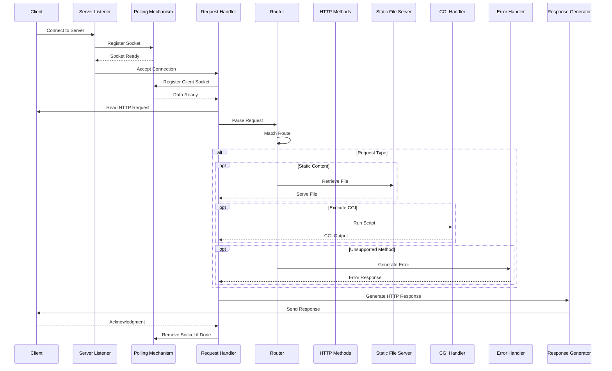

# A HTTP server in C++98

A lightweight HTTP/1.1 compliant web server supporting static file serving, CGI execution, and virtual hosts.

## Features

- **HTTP/1.1 Compliance**
  - `GET`, `POST`, `DELETE` methods
  - Keep-alive connections
  - Status codes per RFC standards

- **Core Functionality**
  - Static file serving
  - Directory listing
  - File uploads
  - CGI execution
  - Virtual host support

- **Performance**
  - Non-blocking I/O
  - Single `select()` multiplexing
  - Connection pooling
  - Memory-efficient design

- **Configuration**
  - Multiple port binding
  - Custom error pages
  - Route-based rules
  - Directory restrictions
  - Upload size limits

## Architecture



## Quick Start

```bash
# Build the server
make

# Run with default config
./webserv config/default.conf

# Test basic functionality
curl http://localhost:8080/
```

## Configuration Example

```nginx
server {
    listen 8080;
    server_name localhost;
    root /var/www;

    location / {
        index index.html;
        methods GET POST;
    }

    location /cgi-bin {
        cgi on;
        cgi_extensions .php .py;
    }
}
```

## Requirements

- C++98 compiler
- POSIX-compliant system
- CMake 3.0+ (for building)

---

This project is part of the 42 school curriculum.
