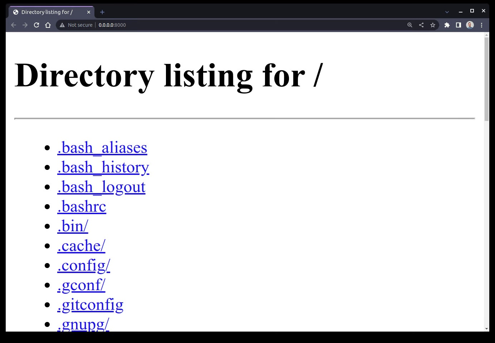
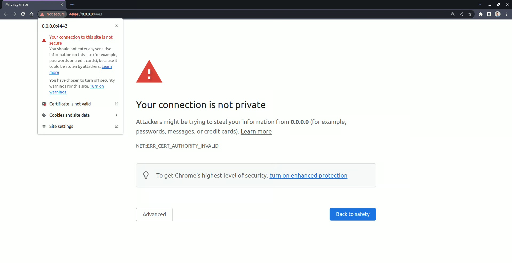

# HTTP Server and CGI in python

Traditionally, if you wanted to handle [HTTP requests](https://realpython.com/urllib-request/) and serve **static content** from files, then you had to set up a full-fledged web server like [Apache](https://httpd.apache.org/) or [NGINX](https://www.nginx.com/), which could be a tedious process. Building a **dynamic web application** requires installing a web framework, such as [Django](https://realpython.com/learning-paths/django-web-development/), [Flask](https://realpython.com/flask-connexion-rest-api/), or [FastAPI](https://realpython.com/fastapi-python-web-apis/), which adds yet another complexity layer. Fortunately, you can take advantage of a basic HTTP server built into Python to avoid all this hassle.

Python’s HTTP server can come in handy when you want to quickly **share a bunch of files**with students in a classroom or anyone else who’s connected to the same network as you. Maybe you need to host static resources downloaded from the Internet for **offline development** of a [PyScript](https://realpython.com/pyscript-python-in-browser/#download-pyscript-for-offline-development) application or spin up a local web server to experiment with the HTTP protocol in your terminal. You may also have a [Python script](https://realpython.com/run-python-scripts/) that should be triggered remotely.

You can do all of this with a single command thanks to the [`http.server`](https://docs.python.org/3/library/http.server.html) module that ships with the Python standard library!

## How to Start Python’s `http.server` in the Command Line

Open a command prompt or [terminal](https://realpython.com/terminal-commands/) window and navigate to the directory where you want to launch the HTTP server. Alternatively, on most modern operating systems, you can right-click a given folder and choose to open the terminal there. Once you’re in the correct place, type and run the following command:

```shell
$ python3 -m http.server
Serving HTTP on 0.0.0.0 port 8000 (http://0.0.0.0:8000/) ...
```

Python starts an HTTP server on port `8000` and binds it to all the available network interfaces on your machine, which are denoted with a special [IP address](https://en.wikipedia.org/wiki/IP_address). Depending on your operating system’s preference, the underlying [`socket`](https://realpython.com/python-sockets/) library may choose to bind to IPv4 address `0.0.0.0` or IPv6 address `::`. Either way, anyone on your network can use your computer’s IP address to access the HTTP server that you just started.

> **Note:** To find your local IP address, you can check your network settings or, depending on your operating system, use one of the commands below:
> - **macOS:** `ifconfig`
> - **Windows:** `ipconfig`
> - **Linux:** `ip address` or `hostname -I`
>
> Visiting a website like [ifconfig.me](https://ifconfig.me/) will reveal your public IP address, which is typically the address of your router. It’s most likely different from the local address of the device that you’re using. Unless you’ve configured [port forwarding](https://en.wikipedia.org/wiki/Port_forwarding) in your router, the HTTP server won’t be accessible from the Internet through your public address.

If the default port number, `8000`, is unavailable, then you’ll see the following error when you make an attempt to start the server:

```shell
$ python3 -m http.server
Traceback (most recent call last):
  ...
OSError: [Errno 98] Address already in use
```

This means that another program is currently occupying that port. To fix this problem, you can find the offending program and forcefully stop it. However, because that may not always be desirable, you can also assign a different port to your server. To explicitly set the port number that your HTTP server should be listening on, append it as a parameter:

```shell
$ python3 -m http.server 8080
Serving HTTP on 0.0.0.0 port 8080 (http://0.0.0.0:8080/) ...
```

Sometimes, it takes trial and error to find a free port, especially when many services are running in the background while listening for network traffic on different ports. Remember that a given port can belong to at most one program at a time, but the same program can own multiple ports simultaneously. Usually, each port is associated with a different service.

> **Note:** Web browsers automatically use port `80` to communicate with web servers over the HTTP protocol, even when you don’t explicitly specify the port number in the address bar. For example, these two addresses are equivalent:
> - `http://localhost:80`
> - `http://localhost`
>
> Port `80` is a standard port reserved for HTTP traffic. However, if you’d like to start a local web server on that special port, then you’ll have to run the corresponding command as the [superuser](https://en.wikipedia.org/wiki/Superuser) with administrative privileges. Otherwise, you’ll get another error:

```shell
$ python3 -m http.server 80
Traceback (most recent call last):
  ...
PermissionError: [Errno 13] Permission denied
```

> All port numbers below `1024` require administrative privileges. You can prefix a command with [`sudo`](https://en.wikipedia.org/wiki/Sudo) to run it as the root user on macOS and Linux. On the other hand, to run a similar command with elevated privileges on Windows, you must first open the terminal as an administrator.

For security reasons, you may restrict access to your HTTP server by running it on an address belonging to the [virtual loopback interface](https://en.wikipedia.org/wiki/Loopback) or `localhost`, which no one except you will be able to speak to. You can bind a specific network interface or IP address by using the `-b` option:

```shell
$ python3 -m http.server -b 127.0.0.42 8080
Serving HTTP on 127.0.0.42 port 8080 (http://127.0.0.42:8080/) ...
```

In this case, you combine the `-b` option, which binds a specific address on the loopback interface, with a positional argument determining the port number. These parameters ensure that your server will only be accessible from the local machine.

> **Note:** When you rely on the defaults, Python will bind to a network address family that your operating system prefers. To enforce a different address, you can use the `-b`option:

```shell
$ python -m http.server -b "::"
Serving HTTP on :: port 8000 (http://[::]:8000/) ...
```

> The double colon (`::`) is a shorthand notation for [IPv6 unspecified address](https://en.wikipedia.org/wiki/IPv6_address#Unspecified_address). In most cases, binding to an IPv6 address will enable [dual-stack IP](https://en.wikipedia.org/wiki/IPv6#Dual-stack_IP_implementation) mode, letting you connect to the server through both IPv4 and IPv6 addresses. However, it doesn’t work the other way around, so binding to an IPv4 address won’t allow you to connect to the server through an IPv6 address.

By default, Python serves the files located in your [current working directory](https://en.wikipedia.org/wiki/Working_directory) where you executed the command to start the server. So, when you visit the home address (`/`) of your server in a web browser, then you’ll see all the files and folders in the corresponding directory:



Here, you see the content of your [home directory](https://en.wikipedia.org/wiki/Home_directory), which is where the server must’ve been started in the command line. Clicking one of the displayed links will send another request to the server, letting you navigate the directory tree in the browser.

You may instruct the server to associate its home address (`/`) with a completely different directory by specifying the optional `-d` parameter:

```shell
$ python3 -m http.server -d ~/Pictures/
Serving HTTP on 0.0.0.0 port 8000 (http://0.0.0.0:8000/) ...
```

Now, the server will list the pictures in one of your home directory’s subfolders. Your shell expands the tilde character (`~`) into the home directory of the current user. Note that you can use both **relative** and **absolute paths** to indicate a directory to serve over HTTP.

The `-d` option may be your only choice in some cases. For instance, if you try to start the HTTP server in a directory where you installed your Python interpreter, then you may face the following problem:

```shell
$ cd /usr/lib/python3.8/
$ python3 -m http.server
Traceback (most recent call last):
  ...
AssertionError: SRE module mismatch
```

Python imports and executes the `http.server` module from a local file found in the current directory. That’s how standard [importing](https://realpython.com/python-import/) rules work in Python. Local files always take precedence over modules with the same name bundled with the interpreter.

You can work around this issue by changing your working directory so that Python will no longer find this module in the file system. Then, start the server using the `-d` option to point it back to the desired directory:

```shell
$ cd ..
$ python3 -m http.server -d /usr/lib/python3.8/
Serving HTTP on 0.0.0.0 port 8000 (http://0.0.0.0:8000/) ...
```

The two dots (`..`) represent the parent directory, so you effectively change your working directory by climbing up one level in the file system hierarchy. This makes the server start correctly.

When you’re done with your HTTP server, you can terminate it by hitting Ctrl+C on your keyboard, which sends the server a [signal](https://en.wikipedia.org/wiki/Signal_(IPC)) to shut down.

You’ve coded a one-liner Python HTTP server! But that’s just the beginning. There’s a lot more to explore when it comes to launching HTTP servers with Python.

## Execute a Script Remotely Through the Common Gateway Interface (CGI)

In this section, you’ll learn how to execute a script remotely through the [Common Gateway Interface (CGI)](https://en.wikipedia.org/wiki/Common_Gateway_Interface), an older technology that’s been largely replaced by newer standards. Although CGI isn’t widely used in modern web development, understanding how it works can provide valuable insights into the evolution of web technologies and may even help you when working with legacy systems.

The Common Gateway Interface (CGI) was a popular standard for implementing web applications with scripting languages like [Perl](https://www.perl.org/) or Python long before the [WSGI](https://en.wikipedia.org/wiki/Web_Server_Gateway_Interface) and [ASGI](https://en.wikipedia.org/wiki/Asynchronous_Server_Gateway_Interface)specifications were defined to unify Python web frameworks. This mechanism allowed web servers to produce **dynamic content**, process [HTML forms](https://en.wikipedia.org/wiki/HTML_form), or authenticate users in the early days of the Internet.

Unlike web frameworks, which focus exclusively on one language and can become quite complex, CGI was a relatively simple technology that defined a *common* interface. As long as your program could read data from the standard input ([stdin](https://en.wikipedia.org/wiki/Standard_streams#Standard_input_(stdin))), [print](https://realpython.com/python-print/) to the standard output ([stdout](https://en.wikipedia.org/wiki/Standard_streams#Standard_output_(stdout))), and access [environment variables](https://en.wikipedia.org/wiki/Environment_variable), you were able to use it as a CGI script.

Here’s how it worked:

- A web server would designate a **special folder**, usually called `cgi-bin/`, where all executable CGI scripts were stored.
- When a user requested a URL that pointed to a CGI script, the web server would execute it, passing the necessary request headers, query parameters, form data, and payload as environment variables.
- The script would then generate dynamic content by printing the HTTP headers and message body to the standard output.
- Finally, the web server would intercept the script’s output and send it back to the user as an HTTP response.

The main **advantage** of CGI was that it didn’t restrict you to using a specific programming language or a particular third-party library. Deploying new services or modifying the existing ones boiled down to manipulating files in the `cgi-bin/` folder without having to restart the server.

The **downside** of this approach was that it was *slow* and inefficient. Each HTTP request resulted in spawning a new interpreter process, which took time and resources, only to terminate it once the script finished running after one use. Web frameworks, on the other hand, keep the application running in the background without having to start from scratch on each request.

Another significant drawback of CGI was its *insecurity*, which could allow an attacker to gain access to the host system if the scripting code wasn’t properly sanitized. That’s because the scripts were executed with the same level of privileges as the web server’s process.

> **Note:** While more modern standards have largely replaced CGI, you can still find it in use today—for example, in simple file upload endpoints.

Python’s `http.server` module is capable of executing CGI scripts implemented in any programming language. You can leverage this feature by following a few steps.

First, make a [special subfolder](https://docs.python.org/3/library/http.server.html#http.server.CGIHTTPRequestHandler.cgi_directories) dedicated to storing CGI scripts in the current working directory:

```shell
$ mkdir cgi-bin/
```

The web server won’t let you browse the content of this folder but will allow you to access the individual files as long as you know their specific names.

Next, create a Python script named, say, `hello.py` inside that directory. It should generally print a raw response, including the HTTP headers, onto the standard output. You’ll expand its source code a bit later, but for now, let the script return a simple [`Hello, World!`](https://en.wikipedia.org/wiki/%22Hello,_World!%22_program)message:

```python
#!/usr/bin/env python3

print(
    """\
Content-Type: text/html

<!DOCTYPE html>
<html lang="en">
<body>
<h1>Hello, World!</h1>
</body>
</html>"""
)
```

It’s essentially a single call to the `print()` function, which outputs the HTTP headers followed by a blank line and a message body. Remember to include a [shebang](https://realpython.com/python-shebang/) in your script if you’re on macOS or Linux. Otherwise, the web server won’t be able to execute the file correctly, thinking it’s a shell script.

Also, on Unix-like operating systems, make the script executable by changing the corresponding file mode:

```shell
$ chmod +x cgi-bin/hello.py
```

This will allow the web server to execute the script and collect its output.

You can now start the server with the optional `--cgi` switch:

```shell
$ python3 -m http.server --cgi
Serving HTTP on 0.0.0.0 port 8000 (http://0.0.0.0:8000/) ...
```

Before doing so, it’s worth making sure that the current working directory includes a `cgi-bin/` subfolder.

Finally, navigate your web browser to `http://0.0.0.0:8000/cgi-bin/hello.py`, changing the host name and port number if necessary. As long as everything goes fine, your browser should render a piece of [HTML](https://realpython.com/html-css-python/) markup, which your Python script generated dynamically.

Note that if you’re on Windows, then you may get away with not specifying the shebang line, which is Unix-specific, as well as setting the file as executable. When you install Python on Windows, the operating system automatically associates the file extension `.py` with the Python interpreter. However, if your CGI script has a different extension, then you’ll get an error when trying to access it on Windows.

While the script gets executed and produces HTML content, it’s not particularly interesting or *dynamic*. It always results in identical output. To spice it up, you can make the script change the document’s background color randomly on each page refresh. Here’s the complete source code of the modified `hello.py` script:

```python
#!/usr/bin/env python3

import os
from http.cookies import SimpleCookie
from random import choices

cookies = SimpleCookie(os.getenv("HTTP_COOKIE"))

try:
    visits = int(cookies["visits"].value) + 1
except KeyError:
    visits = 1

cookies["visits"] = str(visits)
cookies["visits"]["max-age"] = 5  # Expire after 5 seconds

print(
    f"""\
Content-Type: text/html
{cookies}

<!DOCTYPE html>
<html lang="en">
<head>
  <meta charset="utf-8">
  <meta name="viewport" content="width=device-width, initial-scale=1">
  <title>Hello from a CGI Script</title>
  <style>
    body {{
      background-color: #{"".join(choices("0123456789abcdef", k=6))};
    }}
  </style>
</head>
<body>
<h1>CGI Script: {os.getenv("SCRIPT_NAME")}</h1>
<p>You visited this page <b>{cookies["visits"].value}</b> times.</p>
<h2>Environment Variables</h2>
<ul>
  <li><b>CONTENT_TYPE:</b> {os.getenv("CONTENT_TYPE")}</li>
  <li><b>HTTP_USER_AGENT:</b> {os.getenv("HTTP_USER_AGENT")}</li>
  <li><b>QUERY_STRING:</b> {os.getenv("QUERY_STRING")}</li>
  <li><b>REQUEST_METHOD:</b> {os.getenv("REQUEST_METHOD")}</li>
</ul>
</body>
</html>"""
)
```

Because the script outputs content in the HTML format, most of its code is actually an [f-string](https://realpython.com/python-f-strings/) representing the page template. You can break the script down line by line:

- **Line 1** is the shebang sequence that must always appear on the first line of the script on Unix-like operating systems.
- **Lines 3 to 5** import the `os` module to allow for accessing the environment variables, as well as `http.cookies` to abstract away parsing and formatting the [HTTP cookies](https://en.wikipedia.org/wiki/HTTP_cookie). The `choices()` function from the `random` module will let you pick a random background color on **line 30**.
- **Line 7** parses the `Cookie` header, which is delivered to your script through the `HTTP_COOKIE` environment variable, from the incoming HTTP request.
- **Lines 9 to 12** increment the number of visits stored in a cookie or set the initial value to `1` if the cookie wasn’t sent with the request.
- **Lines 14 and 15** assign a new value to the cookie and set its expiration time to `5`seconds.
- **Line 17** prints the HTTP headers followed by the message body onto the standard output. Notice that a blank line separates the header fields on **lines 19 and 20** from the payload, which starts on **line 22**.

You can get information about the HTTP request by inspecting some environment variables. Specifically, the server will set a few [metavariables](https://datatracker.ietf.org/doc/html/rfc3875#section-4.1.18) whose names start with the `HTTP_` prefix, which you might find interesting.

For example, the `HTTP_COOKIE` variable contains any cookies that the user’s browser sends, which can be useful for tracking user sessions or personalizing content. The `HTTP_USER_AGENT` variable provides information about the user’s browser and operating system, which can help you optimize the web application for different devices and platforms.

> **Note:** When you start the server without the `--cgi` flag in the command line or forget to set the correct [`Content-Type`](https://en.wikipedia.org/wiki/MIME#Content-Type) header in your script, then the browser will receive and display the script’s source code instead of the dynamically generated content.

While you can use the `http.server` to serve **static** as well as **dynamic content**, running the server straight from the terminal has its limitations. For example, you’re only able to respond to the [HTTP GET method](https://developer.mozilla.org/en-US/docs/Web/HTTP/Methods/GET), and you don’t have access to more advanced features such as [logging](https://realpython.com/python-logging/) or access control.

Fortunately, you can also use Python’s `http.server` programmatically to have more control.

## Serve Static and Dynamic Content Programmatically

The `http.server` module comes with a few convenience classes that work behind the scenes when you start a server from the command line. However, you can also use or extend those classes directly in your own Python code to customize the behavior of your web server. The module provides two **server classes** based on [`socketserver.TCPServer`](https://docs.python.org/3/library/socketserver.html#socketserver.TCPServer):

- `http.server.HTTPServer`
- `http.server.ThreadingHTTPServer`

As the name implies, the latter extends the former by adding extra capabilities for handling multiple connections [concurrently](https://realpython.com/python-concurrency/) with the help of [threading](https://realpython.com/intro-to-python-threading/). In other words, each request will be handled in a separate thread of execution when you use a `ThreadingHTTPServer`.

Both server classes require a **request handler** object as a parameter. You can pick one of the three base classes to extend and create your own request handler:

- `http.server.BaseHTTPRequestHandler`
- `http.server.SimpleHTTPRequestHandler`
- `http.server.CGIHTTPRequestHandler`

In most cases, you’ll be [subclassing](https://realpython.com/inheritance-composition-python/) the `BaseHTTPRequestHandler` and implementing [methods](https://realpython.com/instance-class-and-static-methods-demystified/) that correspond to the **HTTP methods** of the request, such as `.do_GET()` or `.do_POST()`. The `SimpleHTTPRequestHandler` and `CGIHTTPRequestHandler` classes are used to serve files from the current working directory and execute CGI scripts, respectively. As you might imagine, the `http.server` module uses them internally when you execute it from the terminal.

There’s nothing to stop you from implementing your own miniature web framework on top of these classes! They’ll allow you to serve **static content**, such as [CSS style sheets](https://realpython.com/html-css-python/#style-your-content-with-css), [JavaScript](https://realpython.com/python-vs-javascript/) files, or pictures. At the same time, you can use them to generate **dynamic content** tailored to a particular user and request, which may be based on HTML templates.

For example, you could use [HTTP session cookies](https://en.wikipedia.org/wiki/HTTP_cookie#Session_cookie) to simulate different users logging in and out. You may also perform [URL redirects](https://en.wikipedia.org/wiki/URL_redirection), handle HTML form data sent through a [POST request](https://en.wikipedia.org/wiki/POST_(HTTP)), or read the [query parameters](https://en.wikipedia.org/wiki/Query_string) of a GET request. With the classes in the `http.server`module, your imagination is the only limit!

Because the `http.server` module provides fairly low-level building blocks for creating web servers, you’ll extend the `BaseHTTPRequestHandler` with a custom wrapper. It’ll define several helpers [encapsulating](https://en.wikipedia.org/wiki/Encapsulation_(computer_programming)) higher-level abstractions that are typical for web applications:

```python
# webapp.py

from functools import cached_property
from http.cookies import SimpleCookie
from http.server import BaseHTTPRequestHandler
from urllib.parse import parse_qsl, urlparse

class WebRequestHandler(BaseHTTPRequestHandler):
    @cached_property
    def url(self):
        return urlparse(self.path)

    @cached_property
    def query_data(self):
        return dict(parse_qsl(self.url.query))

    @cached_property
    def post_data(self):
        content_length = int(self.headers.get("Content-Length", 0))
        return self.rfile.read(content_length)

    @cached_property
    def form_data(self):
        return dict(parse_qsl(self.post_data.decode("utf-8")))

    @cached_property
    def cookies(self):
        return SimpleCookie(self.headers.get("Cookie"))

    def do_GET(self):
        ...

    def do_POST(self):
        ...
```

Your request handler defines five [properties](https://realpython.com/python-property/) and overrides two methods from the parent class, which handle HTTP GET and HTTP POST requests. You’ll implement them in a bit.

> **Note:** `HTTPServer` creates a new instance of the specified request handler on each incoming request, passing the relevant information into the handler’s instance variables. Therefore, you can safely [cache](https://realpython.com/lru-cache-python/) the result of your properties using `@cached_property` instead of the regular `@property` [decorator](https://realpython.com/primer-on-python-decorators/) without corrupting other requests’ data.
>
> If you didn’t cache those properties, then accessing some of them more than once could result in undesirable behavior. For example, `.post_data` retrieves bytes from a stateful data stream, which moves its internal data pointer every time you read from it. However, you always want to get the same result from a property.

To demonstrate how your helper properties work in practice, you can pack their values into a [Python dictionary](https://realpython.com/python-dicts/) and then convert them to the [JSON](https://realpython.com/python-json/) format before responding to the client:

```python
# webapp.py

import json
from functools import cached_property
from http.cookies import SimpleCookie
from http.server import BaseHTTPRequestHandler
from urllib.parse import parse_qsl, urlparse

class WebRequestHandler(BaseHTTPRequestHandler):
    # ...

    def get_response(self):
        return json.dumps(
            {
                "path": self.url.path,
                "query_data": self.query_data,
                "post_data": self.post_data.decode("utf-8"),
                "form_data": self.form_data,
                "cookies": {
                    name: cookie.value
                    for name, cookie in self.cookies.items()
                },
            }
        )
```

Here’s what each resulting JSON attribute means:

- `path` is the URL part after the hostname and port number identifying a specific resource on the server, such as `/tutorials/python-http-server`.
- `query_data` is a dictionary of the parameters passed in the [query string](https://en.wikipedia.org/wiki/Query_string). Note that using a dictionary removes duplicate keys, which are allowed in some cases, like when you’re representing multiple choices in an HTML form, for example.
- `post_data` is a stream of bytes representing the payload of the HTTP request. It’s most commonly associated with the HTTP POST method.
- `form_data` is a dictionary representing HTTP form values extracted from the payload. This is only available for string payloads, not specialized formats like JSON or binary data.
- `cookies` is another dictionary of cookie names and their values.

To complete this example, you’ll implement the `.do_GET()` method so that it returns your JSON response to the client. Additionally, you’ll make the `.do_POST()` method delegate execution to the former method:

```python
# webapp.py

import json
from functools import cached_property
from http.cookies import SimpleCookie
from http.server import BaseHTTPRequestHandler
from urllib.parse import parse_qsl, urlparse

class WebRequestHandler(BaseHTTPRequestHandler):
    # ...

    def do_GET(self):
        self.send_response(200)
        self.send_header("Content-Type", "application/json")
        self.end_headers()
        self.wfile.write(self.get_response().encode("utf-8"))

    def do_POST(self):
        self.do_GET()

    # ...

if __name__ == "__main__":
    server = HTTPServer(("0.0.0.0", 8000), WebRequestHandler)
    server.serve_forever()
```

This way, you’ll be able to experiment with both HTTP GET and HTTP POST methods. To take advantage of your custom request handler, you pass it as a mandatory parameter to the new `HTTPServer` instance. Notice that you provide the `WebRequestHandler` class without instantiating it! As you learned before, the server will use this class reference to create a new instance per each incoming request.

You can give your server a try by accessing it through the web browser or using command-line tools like [`curl`](https://en.wikipedia.org/wiki/Curl_(programming_language)) and [`jq`](https://en.wikipedia.org/wiki/Jq_(programming_language)), which will allow you to simulate various scenarios without having to write HTML code for the browser:

```shell
$ curl -s -X POST 'http://0.0.0.0:8000/login?failed=true&lang=en' \
       -H 'Cookie: session=d7f2cf106764;eu_cookie_consent=true' \
       --data 'username=jdoe&password=s3cret' | jq
{
  "path": "/login",
  "query_data": {
    "failed": "true",
    "lang": "en"
  },
  "post_data": "username=jdoe&password=s3cret",
  "form_data": {
    "username": "jdoe",
    "password": "s3cret"
  },
  "cookies": {
    "session": "d7f2cf106764",
    "eu_cookie_consent": "true"
  }
}
```

Here, for example, you send an HTTP POST request with additional headers, cookies, and HTML form data encoded in the message’s payload. The server responds with all that information decoded into a convenient JSON object.

This is just the tip of the iceberg, but it should give you an idea of what’s possible with Python’s `http.server` module. If you’d like to take this code to the next level, then you can download it from the supporting materials and build something on top of it:

However, because `http.server` has [certain limitations](https://realpython.com/python-http-server/#consider-security-and-performance-limitations), you should remain cautious when using it to create a custom web framework. You’ll learn about these limitations at the end of this tutorial.

## Encrypt the Connection With HTTPS

When you open an HTML file directly from your computer in a web browser, the resulting page may not always look right. The web browser will sometimes require your files to be hosted through an HTTP server, or else it won’t be able to find and interpret them correctly. That’s because the web browser needs to make requests to a server in order to fetch those files.

So far, you’ve been communicating with your HTTP server using an unencrypted connection. That’s fine for testing or learning how the HTTP protocol works by observing the raw requests and responses in plain text. But for safety reasons, most web browsers will prevent you from accessing some of their APIs, such as the [Geolocation API](https://en.wikipedia.org/wiki/W3C_Geolocation_API), unless the page was served through a secure connection.

To understand this process a bit more, you can experiment with making HTTP requests manually. For example, you can use a command-line program like [netcat](https://en.wikipedia.org/wiki/Netcat) or a [Telnet](https://en.wikipedia.org/wiki/Telnet) client, such as [PuTTY](https://en.wikipedia.org/wiki/PuTTY) on Windows, to connect to a running HTTP server and issue HTTP requests, typing them by hand:

```shell
$ telnet localhost 8000
Trying 127.0.0.1...
Connected to localhost.
Escape character is '^]'.
HEAD / HTTP/1.0

HTTP/1.0 200 OK
Server: SimpleHTTP/0.6 Python/3.11.3
Date: Wed, 26 Apr 2023 09:28:10 GMT
Content-type: text/html; charset=utf-8
Content-Length: 5163

Connection closed by foreign host.
```

The highlighted line represents the **request line** comprising the HTTP method ([`HEAD`](https://developer.mozilla.org/en-US/docs/Web/HTTP/Methods/HEAD)), a resource path (`/`), and a protocol version (`HTTP/1.0`), which you’d enter from the keyboard. What comes next is the server’s response, which starts from the **status line** followed by a few headers. By inspecting one of the response headers, you can tell that you’ve connected to a Python `http.server`.

There’s no message body in the server’s response because, with the `HEAD` method, you requested the headers only. However, the `Content-Length` header field reveals the size of the resource that you asked about, which is 5,163 bytes long.

> **Note:** Because HTTP is a *stateless* protocol, the server closes the connection as soon it sends a response to the client. However, newer versions of the HTTP protocol allow the server to keep the connection alive to handle subsequent requests more efficiently. This is known as a [persistent connection](https://en.wikipedia.org/wiki/HTTP_persistent_connection).

Today, most online services don’t support pure HTTP anymore due to security concerns. Instead, they might *redirect* you to the same URL but over the encrypted [HTTPS](https://realpython.com/python-https/) connection. In such a case, you’ll typically receive an [HTTP 3xx](https://en.wikipedia.org/wiki/URL_redirection#HTTP_status_codes_3xx) status code along with a `Location` header pointing to the desired address:

```shell
$ telnet realpython.com 80
Trying 2606:4700:10::ac43:2b37...
Connected to realpython.com.
Escape character is '^]'.
GET / HTTP/1.0
Host: realpython.com

HTTP/1.1 301 Moved Permanently
Date: Wed, 26 Apr 2023 09:45:48 GMT
Content-Type: text/html; charset=utf-8
Connection: close
Location: https://realpython.com/
X-Content-Type-Options: nosniff
Referrer-Policy: strict-origin-when-cross-origin,origin
Cross-Origin-Opener-Policy: same-origin
Via: 1.1 vegur
CF-Cache-Status: DYNAMIC
Server: cloudflare
CF-RAY: 7bdde5069f74fbc2-WAW
alt-svc: h3=":443"; ma=86400, h3-29=":443"; ma=86400

Connection closed by foreign host.
```

Here, you can see that the Real Python website wants you to access it using the secure HTTPS protocol. If you type the insecure address `http://realpython.com` into your web browser’s address bar, then it’ll immediately follow the redirection link, changing your URL to start with `https://` instead.

> **Note:** While `443` is the standard port number for HTTPS connections, it’s not enough to replace port `80` in the `telnet` command. You need a different program, like an [OpenSSL](https://en.wikipedia.org/wiki/OpenSSL) client, that’s capable of establishing secure connections and using encryption:

```shell
$ openssl s_client -connect realpython.com:443
```

> By running this command, you’ll take a peek at the [SSL/TLS handshake](https://en.wikipedia.org/wiki/Transport_Layer_Security#TLS_handshake) messages that the client and server exchange to negotiate a shared secret used to encrypt all subsequent messages. You’ll also be able to see the server’s [X.509](https://en.wikipedia.org/wiki/X.509) [digital certificate](https://en.wikipedia.org/wiki/Transport_Layer_Security#Digital_certificates)that verifies the server’s identity.

Unfortunately, the `http.server` module built into Python doesn’t support the HTTPS protocol out of the box. To run your web server securely, you’ll have to extend it by wrapping the underlying [TCP socket](https://en.wikipedia.org/wiki/Network_socket) with a [TLS/SSL](https://en.wikipedia.org/wiki/Transport_Layer_Security) layer:

```python
# secure_server.py

from http.server import HTTPServer, SimpleHTTPRequestHandler
from ssl import PROTOCOL_TLS_SERVER, SSLContext

ssl_context = SSLContext(PROTOCOL_TLS_SERVER)
ssl_context.load_cert_chain("/path/to/cert.pem", "/path/to/private.key")
server = HTTPServer(("0.0.0.0", 443), SimpleHTTPRequestHandler)
server.socket = ssl_context.wrap_socket(server.socket, server_side=True)
server.serve_forever()
```

You can do so by using the [`ssl`](https://docs.python.org/3/library/ssl.html) module from Python’s standard library. Remember that starting a web server on the default port, `443`, will require administrative privileges. So, if you don’t mind explicitly including the port number in your URL, then you may choose a higher port number, like `4443`.

Moreover, you’ll need to obtain a valid certificate from a trusted [certificate authority (CA)](https://en.wikipedia.org/wiki/Certificate_authority), which generally requires purchasing and renewing the certificate after a certain period. Some well-known certificate authorities, such as [Let’s Encrypt](https://letsencrypt.org/), are nonprofit organizations that can provide you with a certificate at no charge.

However, for testing purposes, you can quickly generate and use a [self-signed certificate](https://en.wikipedia.org/wiki/Self-signed_certificate), which is completely free.

## Generate a Self-Signed Certificate Using Python

If you’re on macOS or Linux, then you can create and sign a new certificate using a command-line client for the OpenSSL library:

```shell
$ openssl req -x509 \
              -nodes \
              -days 365 \
              -newkey rsa:2048\
              -out cert.pem \
              -keyout private.key
```

When running this command, you’ll be asked a few questions about your certificate interactively. The most important answer to give is the `Common Name (CN)`, which must be a fully-qualified domain name ([FQDN](https://en.wikipedia.org/wiki/Fully_qualified_domain_name)) of your server. Alternatively, you can provide a fixed IP address, like `0.0.0.0`.

Afterward, you’ll have two [PEM-encoded](https://en.wikipedia.org/wiki/Privacy-Enhanced_Mail) files required by the Python script mentioned earlier. The first file is a certificate (`-x509`) using a 2,048-bit [RSA](https://en.wikipedia.org/wiki/RSA_(cryptosystem)) encryption algorithm (`-newkey rsa:2048`), which will remain valid for one year (`-days 365`). The other file is the corresponding [private key](https://en.wikipedia.org/wiki/Public-key_cryptography) stored in an unencrypted form (`-nodes`) that you should keep secret.

While a self-signed certificate will encrypt your data, web browsers won’t trust it due to the unknown certificate authority that signed it—namely, *you*.

Go ahead, update the paths in `secure_server.py` so that they point to your certificate and private key, and then start the server. You should see something odd after navigating your browser to the server’s address:



When you visit a page that uses a self-signed certificate, most web browsers will usually display a warning about an insecure connection, letting you decide whether to proceed to the website or not. In the screenshot above, you see how such a warning may look in [Google Chrome](https://www.google.com/chrome/), although other browsers will show a similar message.

That’s because a self-signed certificate appears to be invalid in the eyes of a web browser, which can’t verify its authenticity. Each browser comes with a list of well-known and trusted certificate authorities. You can also install additional certificates on your operating system to make the browser accept such a connection as secure.

Typing cryptographic commands into the terminal can sometimes feel like casting a spell if you don’t understand or remember the individual options, though. Plus, it may not work for everyone depending on their operating system and installed tools. Therefore, you’ll use your favorite programming language to automate generating a self-signed certificate.

First, install a suitable third-party Python package into your [virtual environment](https://realpython.com/python-virtual-environments-a-primer/). For example, [pyOpenSSL](https://pypi.org/project/pyOpenSSL/) provides the necessary Python bindings for the OpenSSL library:

```shell
(venv) $ python -m pip install pyOpenSSL
```

Once that’s installed, you can define a `SelfSignedCertificate` class with sensible defaults for the essential fields that a digital certificate requires:

```python
# self_signed.py

from dataclasses import dataclass

@dataclass(frozen=True)
class SelfSignedCertificate:
    host: str = "0.0.0.0"
    bits: int = 2048
    country: str = "CA"
    state: str = "British Columbia"
    locality: str = "Vancouver"
    organization: str = "Real Python"
    organizational_unit: str = "Development"
    serial_number: int = 1
    expires_on: int = 365 * 24 * 60 * 60
```

Specifically, you take advantage of a [Python data class](https://realpython.com/python-data-classes/) to generate the [initializer method](https://realpython.com/python-class-constructor/)encompassing all these parameters. Thanks to this, you can override some of those values if necessary at any time. You’re most likely to adjust the `.host` attribute to match your server’s **IP address** or **domain address**.

Next, add a property to your class, which will generate and [cryptographically sign](https://en.wikipedia.org/wiki/Digital_signature) the new certificate based on those fields:

```python
# self_signed.py

import tempfile
from dataclasses import dataclass
from pathlib import Path

from OpenSSL.crypto import (
    FILETYPE_PEM,
    TYPE_RSA,
    X509,
    PKey,
    dump_certificate,
    dump_privatekey
)

@dataclass(frozen=True)
class SelfSignedCertificate:
    # ...

    @property
    def path(self) -> Path:
        key_pair = PKey()
        key_pair.generate_key(TYPE_RSA, self.bits)

        certificate = X509()

        subject = certificate.get_subject()
        subject.CN = self.host
        subject.C = self.country
        subject.ST = self.state
        subject.L = self.locality
        subject.O = self.organization
        subject.OU = self.organizational_unit

        certificate.set_serial_number(self.serial_number)
        certificate.gmtime_adj_notBefore(0)
        certificate.gmtime_adj_notAfter(self.expires_on)
        certificate.set_issuer(subject)
        certificate.set_pubkey(key_pair)
        certificate.sign(key_pair, "sha256")

        with tempfile.NamedTemporaryFile(delete=False) as file:
            file.write(dump_privatekey(FILETYPE_PEM, key_pair))
            file.write(dump_certificate(FILETYPE_PEM, certificate))

        return Path(file.name)
```

The `.path` property creates a brand-new certificate on the fly, signs it using the generated key, and then dumps the certificate to a [temporary file](https://realpython.com/working-with-files-in-python/#making-temporary-files-and-directories) along with your private key. Note that both the certificate and the key end up in a single file this time. You can grab the corresponding path by intercepting the property’s returned value, which happens to be a `Path` object from [Python’s `pathlib` module](https://realpython.com/python-pathlib/).

Once you have the self-signed certificate in place, you can pass it over to your server. However, to make sure that the server runs on the correct address that your certificate was issued for, it’s worth using [`argparse`](https://realpython.com/command-line-interfaces-python-argparse/) to read the desired host and port number from the command line.

Here’s the final source code of your next Python script, `https_server.py`, which will use the `SelfSignedCertificate` data class from your `self_signed` helper module:

```python
# https_server.py

import argparse
import webbrowser
from http.server import HTTPServer, SimpleHTTPRequestHandler
from ssl import PROTOCOL_TLS_SERVER, SSLContext

from self_signed import SelfSignedCertificate

def main(args):
    ssl_context = SSLContext(PROTOCOL_TLS_SERVER)
    ssl_context.load_cert_chain(SelfSignedCertificate(args.host).path)
    server = HTTPServer((args.host, args.port), SimpleHTTPRequestHandler)
    server.socket = ssl_context.wrap_socket(server.socket, server_side=True)
    webbrowser.open(f"https://{args.host}:{args.port}/")
    server.serve_forever()

def parse_args():
    parser = argparse.ArgumentParser()
    parser.add_argument("--host", type=str, default="0.0.0.0")
    parser.add_argument("--port", type=int, default=443)
    return parser.parse_args()

if __name__ == "__main__":
    main(parse_args())
```

Notice how you pass a single file path to the SSL context on the highlighted line. Additionally, on **line 15**, you open the server’s URL in your default web browser shortly before the server starts.

You can test if this works by starting your shiny new HTTPS server on the specified host and port:

```shell
(venv) $ python https_server.py --host 127.0.0.42 --port 4443
```

Don’t forget to activate the right virtual environment with OpenSSL bindings for Python before running this command. When you do, your default web browser should open, giving you a warning that you can safely ignore unless you don’t trust yourself.

Now that you’ve seen some interesting use cases for Python’s `http.server`, it’s time to consider its limitations. After all, there must be reasons for the plethora of web frameworks and other tools out there.

## Consider Security and Performance Limitations

Despite the undoubted advantages, which include its **simplicity** and availability in the Python **standard library**, the `http.server` module is severely limited in terms of security and performance. The official documentation makes that clear right off the bat:

> **Warning:** `http.server` is not recommended for production. It only implements basic security checks. ([Source](https://docs.python.org/3/library/http.server.html))

One of the main reasons why you can’t consider this server secure is that it’ll follow [symbolic links](https://en.wikipedia.org/wiki/Symbolic_link), escaping the current working directory and serving files outside of it as if they were local files. That could potentially lead to information leakage and other unexpected side effects.
If you’re on a Unix-like operating system, which supports **symlinks**, then you can simulate this unwanted behavior by creating the following directory structure:

```shell
./
├── private/
│   ├── password1.txt
│   └── password2.txt
│
└── public/
    ├── home.html
    ├── linked_file.txt -> /home/realpython/private/password1.txt
    └── linked_dir -> /home/realpython/private
```

There are two folders populated with sample files. One of the folders is meant to be kept secret, while the other one is supposed to be publicly accessible. That’s where you’ll start your HTTP server. Notice that the `public/` folder contains a symbolic link to one of the secret files with someone’s password and another to the entire `private/` folder.

To arrive at this directory tree, you can run these commands in your terminal:

```shell
$ mkdir private/ public/

$ echo 's3cret' > private/password1.txt
$ echo 'pa55w0rd' > private/password2.txt
$ echo '<h1>Hello!</h1>' > public/home.html

$ ln -s $(pwd)/private/password1.txt $(pwd)/public/linked_file.txt
$ ln -s $(pwd)/private $(pwd)/public/linked_dir
```

It’s best to deal with absolute paths when calling the `ln -s` command, which is why you use `pwd` to resolve relative paths into absolute ones.

Now, you can start your HTTP server using the optional `-d` parameter to [sandbox](https://en.wikipedia.org/wiki/Sandbox_(software_development)) the files to the `public/` folder:

```shell
$ python3 -m http.server -d public/
Serving HTTP on 0.0.0.0 port 8000 (http://0.0.0.0:8000/) ...
```

Because the specified folder contains symbolic links, the server will happily follow them. Therefore, when you navigate your browser to the server’s home address, you’ll be able to view the linked secret password. Moreover, you can browse the contents of the entire `private/` folder, including files that you haven’t linked!

On the performance side of things, the server is limited by its relatively poor speed and scalability. The whole `http` package is implemented in pure Python with little consideration for concurrency, caching, or other optimization mechanisms. This makes it too slow for anything but the most basic applications, as it wasn’t designed with large-scale or high-traffic websites in mind.

Apart from that, it lacks many advanced features like SSL support or user session management that you might expect from a full-fledged web framework.

All in all, don’t use it in production! However, the `http.server` module that ships with Python is hard to beat when it comes to experimenting, quickly serving static files, or even prototyping a simple web application.

## Conclusion

In this tutorial, you’ve learned how to use Python’s `http.server` as a convenient alternative to web servers like Apache or NGINX to serve **static files** from a specific folder. You’ve seen how to start the server with a single command to quickly share files with others on the same network or to experiment with the HTTP protocol.

Additionally, you leveraged the Common Gateway Interface (CGI) to generate **dynamic web content** by executing scripts remotely. You’ve also built a miniature web framework by extending a few classes from the `http.server` module. As a quick and dirty approach, this allowed you to write a basic web application with a login form without using heavy-duty web frameworks like Flask or Django.

Finally, you made your HTTP server more secure by generating a self-signed digital certificate and using encryption over HTTPS.

---
Source: [https://realpython.com/python-http-server/](https://realpython.com/python-http-server/)
